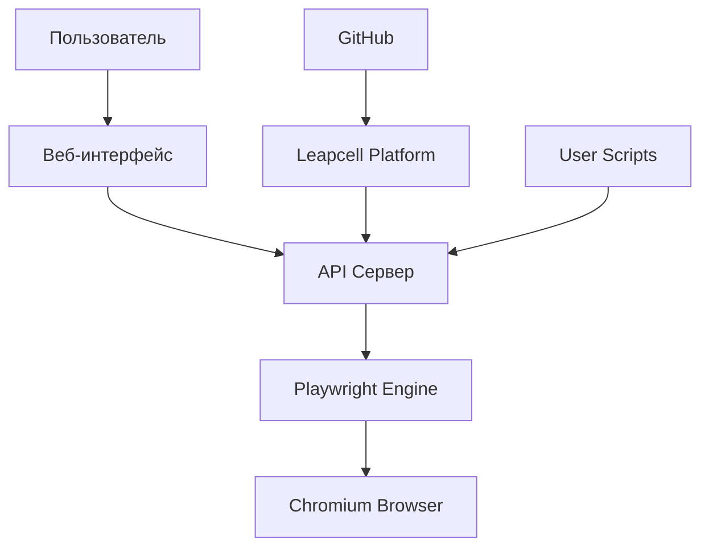

# Архитектура проекта Playwright-Leapcell

## Общее описание

Проект представляет собой веб-приложение, которое позволяет запускать пользовательские скрипты Playwright в браузере Chromium через веб-интерфейс. Приложение интегрировано с платформой Leapcell и Github для автоматического развертывания и управления.

## Архитектурная схема



## Компоненты системы

### 1. Веб-интерфейс
- Предоставляет пользователю возможность загружать скрипты
- Отображает статус выполнения скриптов
- Показывает логи выполнения

### 2. API Сервер (FastAPI/Flask)
- Принимает запросы от веб-интерфейса
- Управляет очередью выполнения скриптов
- Запускает Playwright скрипты
- Обрабатывает загрузку файлов
- Ведет логирование

### 3. Playwright Engine
- Выполняет пользовательские скрипты в браузере Chromium
- Управляет жизненным циклом браузера
- Обеспечивает изоляцию выполнения скриптов

### 4. Chromium Browser
- Браузер для выполнения автоматизации
- Запускается и останавливается по запросу

## Структура файлов проекта

```
playwright-leapcell/
├── main.py                 # Основной сервер приложения
├── requirements.txt        # Зависимости проекта
├── leapcell.yaml           # Конфигурационный файл Leapcell
├── prepare_playwright_env.sh  # Скрипт подготовки окружения Playwright
├── google_1.py             # Пример пользовательского скрипта
├── human_instruction.md    # Инструкции для пользователя
├── project_architecture.md # Документация по архитектуре
├── README.md               # Основная документация проекта
└── static/                 # Статические файлы (CSS, JS, изображения)
    └── style.css           # Стили для веб-интерфейса
```

## Поток выполнения

1. Пользователь загружает скрипт через веб-интерфейс или помещает его в директорию проекта
2. API сервер получает запрос на выполнение скрипта
3. Скрипт помещается в очередь выполнения
4. Playwright Engine запускает браузер Chromium
5. Скрипт выполняется в браузере
6. Результаты выполнения логируются и возвращаются пользователю
7. Браузер останавливается после завершения скрипта
8. Система переходит в пассивное состояние до следующего запроса

## Технические требования

### Зависимости
- Python 3.8+
- Playwright для Python
- FastAPI или Flask для веб-сервера
- Chromium браузер

### Ресурсы Leapcell (Free Tier)
- Память: до 1024MB
- Время выполнения: до 15 минут на запрос
- Concurrent requests: до 30 одновременных запросов

## Возможности расширения

1. Добавление поддержки других браузеров (Firefox, WebKit)
2. Реализация очереди задач для управления множественными скриптами
3. Добавление планировщика выполнения скриптов по расписанию
4. Интеграция с системами мониторинга и алертинга
5. Поддержка пользовательских cookies и сессий